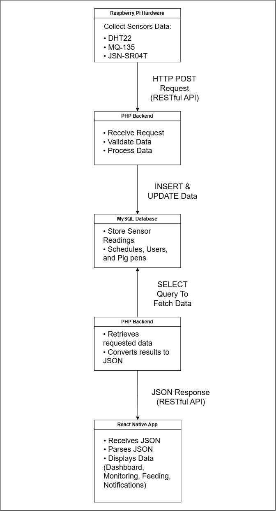
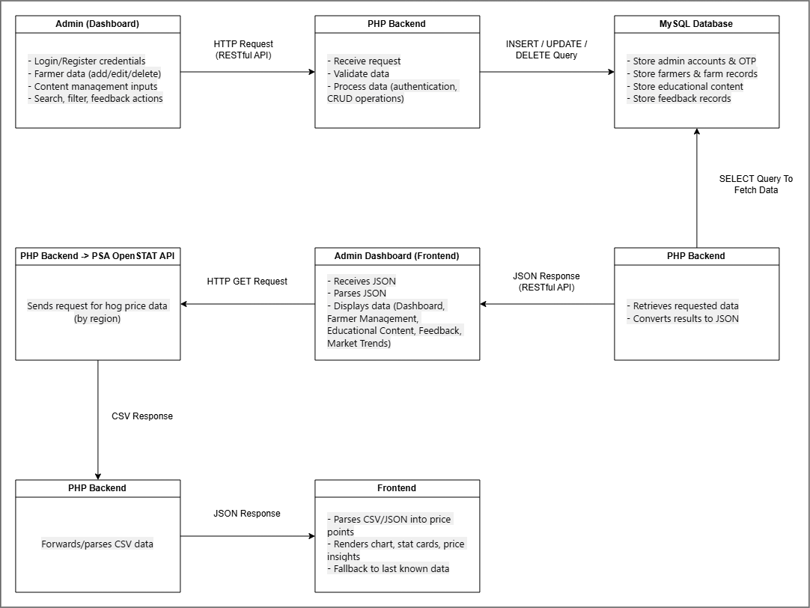

# OinkMate: Raspberry Pi-Based Automated Sanitation and Smart Feeding System for Piggeries

## Team

**Team Leader**
- Ronian U. Hayag

**Team Members**
- Evina R. Suanes
- Janelle Mae V. De Torres

---

# Introduction

## Purpose

OinkMate is a capstone project that aims to design and develop a **Raspberry Pi-Based Automated Sanitation and Smart Feeding System for Piggeries**. The system assists farmers in managing feeding, sanitation, environmental monitoring, and piggery operations through automation, real-time monitoring, and decision-support features accessible via a mobile application.

### Objectives

- Design and develop a Raspberry Pi-Based Automated Sanitation and Smart Feeding System for Piggeries.
- Automate feeding and sanitation processes in piggery operations.
- Provide real-time environmental monitoring using integrated sensors.
- Assist farmers in making informed decisions through mobile-based monitoring and recommendation features.
- Improve the efficiency, convenience, and management of piggery operations while reducing manual labor.

---

# Scope of the Study

The study covers the following:

- Design and development of a Raspberry Pi-Based Automated Sanitation and Smart Feeding System for Piggeries.
- Development of a mobile application for farmers to monitor and manage piggery operations.
- Real-time monitoring of temperature, humidity, and ammonia gas levels.
- Automated sanitation through scheduled cleaning and showering cycles.
- Automatic showering during high-temperature conditions.
- Water usage monitoring and sanitation notifications.
- Automated feeding based on scheduled feed dispensing.
- Farmer input of pig population, age in days, and estimated weight.
- Feeding recommendations based on predefined feeding references.

### Mobile Application Features

- Real-Time Environmental Monitoring
- Feeding and Sanitation Status Monitoring
- Notifications and Alerts
- Manual Override Controls
- Multi-Pen Management

### Decision-Support Features

- Feeding and Sanitation Recommendations
- Pig Support Guidelines
- Estimated Market Value
- Suggested Selling Period

### System Evaluation

The system will be evaluated based on:

- Functionality
- Efficiency
- Reliability
- Usability
- Sensor Accuracy

---

# Definitions

| Term | Description |
|------|-------------|
| Alerts and Notifications | Provides updates regarding feeding schedules, sanitation cycles, low feed levels, and temperature-triggered showering. |
| Ammonia Sensor | Detects ammonia gas concentration inside the piggery. |
| Automated Flushing System | Performs scheduled cleaning of pig pens. |
| Environmental Monitoring | Monitors temperature, humidity, and ammonia levels. |
| Feeding Recommendation | Suggests feed type and estimated daily feed amount. |
| Humidity Sensor | Measures humidity levels. |
| IoT | Connects sensors and devices for monitoring and automation. |
| Mobile Application | Allows farmers to monitor and manage the system remotely. |
| Multi-Pen Management | Enables management of multiple pig pens. |
| Raspberry Pi | Processes sensor data and controls system operations. |
| Real-Time Monitoring Dashboard | Displays live sensor readings and system status. |
| Servo Motor | Controls feeding and sanitation mechanisms. |
| Smart Feeding Module | Dispenses feed automatically. |
| Temperature Sensor | Measures ambient temperature. |
| Ultrasonic Sensor | Detects feed level inside the feed container. |
| Water Flow Sensor | Measures water consumption during sanitation. |

---

# Overall Description

  

---

  

---

# System Requirements

## Mobile Application (Farmer)

### Farmer Management

- Farmer Registration
- Farmer Login and Authentication
- Farmer Session Management

### Dashboard

- Dashboard Overview
- Real-Time Environmental Monitoring
- Farm Overview
- Recent Alerts and Notifications
- Quick Access Navigation

### Pig Pen Management

- Add Pig Pen
- Edit Pig Pen
- Delete Pig Pen
- View Pig Pen Details
- Multi-Pen Management

### Feeding Management

- View Feeding Schedules
- Add Feeding Schedule
- Edit Feeding Schedule
- Delete Feeding Schedule
- Manual Feeding Control
- Feeding Recommendation

### Sanitation Management

- View Sanitation Schedules
- Add Sanitation Schedule
- Edit Sanitation Schedule
- Delete Sanitation Schedule
- Manual Sanitation Control

### Environmental Monitoring

- Temperature Monitoring
- Humidity Monitoring
- Ammonia Level Monitoring

### Expense Management

- Expense Overview
- Add Expense
- View Expense History
- Category-Based Expense Tracking

---

# Website Application (Admin)

## User Management

- Administrator Login and Authentication
- Administrator Session Management
- Administrator Profile Management

## Dashboard

- Dashboard Overview
- Total Registered Farmers
- Total Registered Pig Pens
- Quick Access Navigation

## Farmer Management

- View Registered Farmers
- Search Farmers
- View Farmer Information
- View Farm Information

## Educational Content Management

- Add Educational Content
- Edit Educational Content
- Delete Educational Content
- View Educational Content
- Publish Advisories
- Publish Announcements

## Feedback Management

- View Farmer Feedback
- Filter Feedback
- Manage Feedback Status

## Settings

- Administrator Account Management
- Change Password

## Reports

- View System Reports
- Generate Summary Reports
- Export Reports

---

# OinkMate Hardware Prototype

## Hardware Components

- Raspberry Pi Pico 2 W
- DHT22 Temperature and Humidity Sensor
- MQ135 Gas Sensor
- JSN-SR04T Waterproof Ultrasonic Sensor (3x)
- MG996R Servo Motor
- MG90S Servo Motor
- Breadboard
- Jumper Wires
- Resistors (4× 1kΩ and 4× 2kΩ)

---

# Prototype Demonstrations

- Real-time temperature and humidity monitoring using DHT22.
- Ammonia gas level monitoring using MQ135.
- Distance measurement using three JSN-SR04T ultrasonic sensors for feed level detection.
- MG996R servo motor demonstration for the feeding mechanism.
- MG90S servo motor demonstration for the sanitation mechanism.
- Communication testing between the Raspberry Pi Pico 2 W and all connected sensors and actuators.

---

# Technologies Used

### Hardware

- Raspberry Pi Pico 2 W
- DHT22
- MQ135
- JSN-SR04T
- MG996R
- MG90S

### Software

- React Native (Expo)
- React (Admin Website)
- TypeScript
- PHP
- MySQL
- XAMPP
- Git & GitHub

---

## License

This repository contains the capstone project of **Ronian U. Hayag, Evina R. Suanes, and Janelle Mae V. De Torres**.
